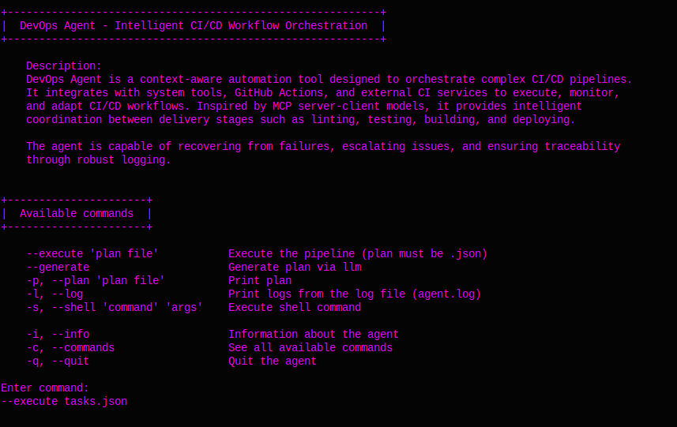
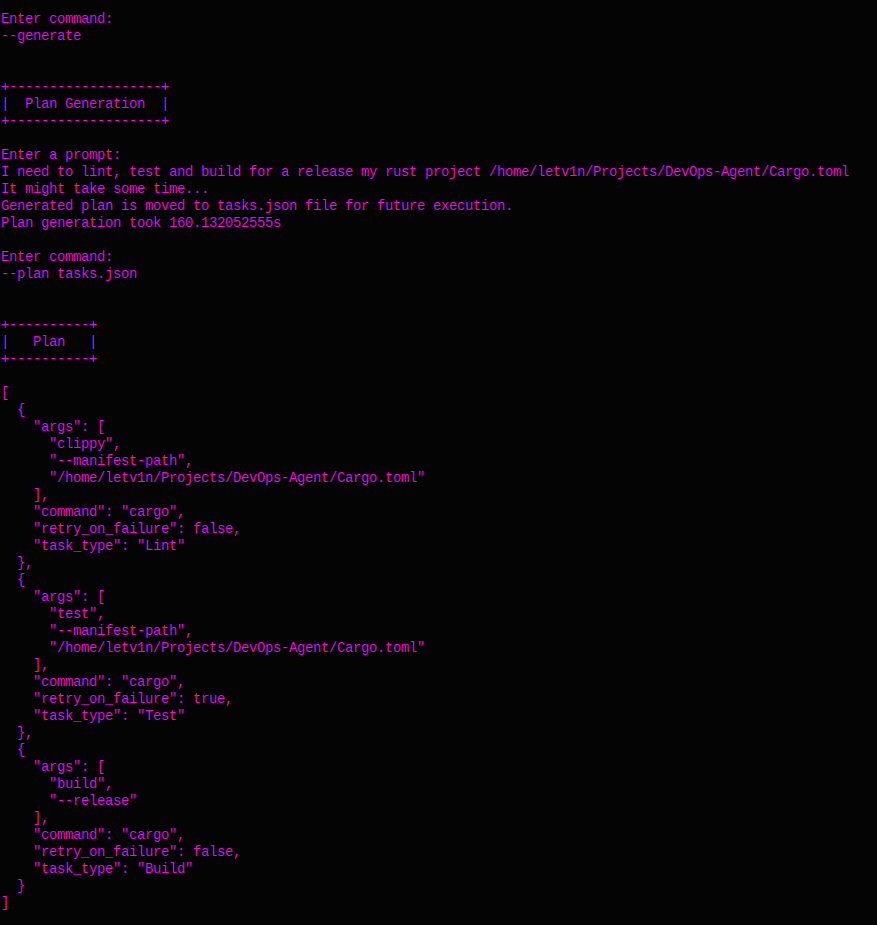
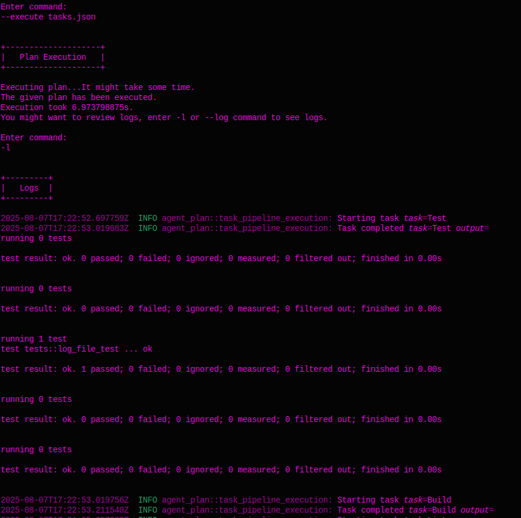

# DevOps Agent

## Description
***DevOps Agent with CI/CD Tasking***

Modern delivery pipelines are increaseingly complex, invlolving tasks like environment provisioning, code linting, test orchestration, build artifact generation, and deployment rollouts. These tasks are often automated, but rarely orchestrated by sintelligent agents that understand context, adjust plans, or recover from failure. 

A ***DevOps Agent*** can fill this gap by triggering, monitoring and adapting CI/CD workflow based on plans and goals. The agent is able to invoke shell commands, interact with GitHub Actions or external CI tools, validate results and escalate issues based on configurable rules. It also has a full logging capability.

***Core Agent Responsibilities***

The DevOps agent's primary functions include:

- Executing predefined CI/CD stages (lint, test, build, deploy).
- Receiving tasks via command-line, REST, or LLM-generated plans.
- Running system-level tools securely (e.g., docker, cargo, gh).
- Logging all results and detecting failed or flaky tasks.
- Supporting rollback or retry for critical stages.

## Current Problems
Agent needs to have a strong validation of LLM generated CI/CD pipeline. It's very crucial in complicated pipelines, so agent do not crash after some error due to incorrectly generated plan.


## Build and Clone
You primarily need to install [rust](https://www.rust-lang.org/tools/install) compiler. 
For Windows go to the provided official website and download it from there, for other operating systems like Linux, Mac or WSL use:
```bash
curl --proto '=https' --tlsv1.2 -sSf https://sh.rustup.rs | sh
```

***Clone***
```bash
git clone https://github.com/letv1nnn/DevOps-Agent.git
cd DevOps-Agent/
```

***Build***
```bash
cargo build --release
```

***Run***
```bash
./target/release/agent_main --interface CLI
# add .exe extension to the path if you use Windows OS
# you can use cli, api or mcp argument (currently only cli version available).
```

***Clean***
```bash
cargo clean # removes /target directory
```

## How to use?
### CLI
When you run the cli version of the agent, it initially would print a small description and all available commands.

**NOTE**: You might use faster ollama model, like wizardlm2, unfortunately I have 8 gigs of ram.

### CLI Example 
I want to generate the CI plan and execute a it for this agent. So I'd lint, test and build my project.
To create this pipeline I've called "--generate" command, then entered a relevant prompt. After that, Ollama generated the plan and putted it into the "tasks.json" file. Then, I wrote "--plan tasks.json" to look at the generated plan to review it. Finally, typed "--execute tasks.json" command to execute the pipeline, in consequence it suggests me to type "-l" or "--log" to see the logs/result of the execution.

Get started



Generating and printing the CI pipepline plan



CI pipeline execution and printing the outcome logs

