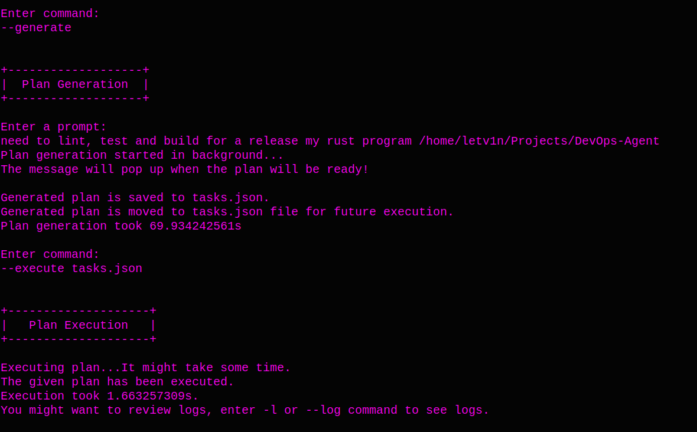

# DevOps Agent

## Description
***DevOps Agent with CI/CD Tasking***

Modern delivery pipelines are increaseingly complex, invlolving tasks like environment provisioning, code linting, test orchestration, build artifact generation, and deployment rollouts. These tasks are often automated, but rarely orchestrated by intelligent agents that understand context, adjust plans, or recover from failure. 

A ***DevOps Agent*** can fill this gap by triggering, monitoring and adapting CI/CD workflow based on plans and goals. The agent is able to invoke shell commands, interact with GitHub Actions or external CI tools, validate results and escalate issues based on configurable rules. It also has a full logging capability.

***Core Agent Responsibilities***

The DevOps agent's primary functions include:

- Executing predefined CI/CD stages (lint, test, build, deploy).
- Receiving tasks via command-line, REST, or LLM-generated plans.
- Running system-level tools securely (e.g., docker, cargo, gh).
- Logging all results and detecting failed or flaky tasks.
- Supporting rollback or retry for critical stages.

## Notes

make the agent primarilly to scan the given directoy, I mean it would list all files and dirs in there, so the llm would understand whoch build system for instance it would use in a plan

if there is an error or a bug in the plan, then while executing the tasks.json file for instance, it's panic. However, I need to regenerate the plan if I encounter such en issue, not panic.

solve the issue with async tasks, for now, it's specifically the --generation case, it does work wierd...

check if any of the json keys is not empty, I need to implement a retry for a failed plan generation in order to jus send a failed response.

if I executes something twice, it appends logs from the execution to the old logs.


## Preinstallation

You primarily need to install [rust](https://www.rust-lang.org/tools/install) compiler. 
- **Windows:** Visit the official Rust website and download the installer.  
- **Linux, macOS, or WSL:**

```bash
curl --proto '=https' --tlsv1.2 -sSf https://sh.rustup.rs | sh
```
Also, since this agent uses Ollama LLM, you need to install it. Fow Windows, go to [ollama](https://ollama.com/download/windows) website. For other operating systems, including WSL, you might use the following command.
```bash
curl -fsSL https://ollama.com/install.sh | sh
```

**NOTE**: For this agent, I've used ***mistral*** model, it's kind of slow, so you might use faster ollama model, like ***wizardlm2***. ***mistral*** suits for 8gb ram laptops.


## Build and Clone

***Clone***
```bash
git clone https://github.com/letv1nnn/DevOps-Agent.git
cd DevOps-Agent/
```

***Build***
```bash
cargo build --release
```

***Run***
1. add .exe extension to the path if you use Windows OS
2. you can use cli, api or mcp argument (currently only cli version available).
```bash
./target/release/agent_main --interface CLI
```

***Clean***
```bash
cargo clean # removes /target directory
```

## How to use?
### CLI
When you run the CLI version of the agent, it first displays a short description and lists all available commands.

### CLI Example 
In this example, I’ll lint, test, and build the agent in release mode.
I don’t want to create a plan manually, so I’ll ask the LLM to generate one for me by passing the ***--generate*** command. Depending on your hardware, the LLM will create a plan in 0.3–3 minutes when using the ***mistral*** model.

The CLI will also suggest using the ***-l*** or ***--log*** command to review logs.
You can inspect the LLM-generated plan before executing it.

If you’re concerned about security—such as the risk of a malicious ***rm -rf*** command—the agent validates commands before execution to prevent unsafe actions.

